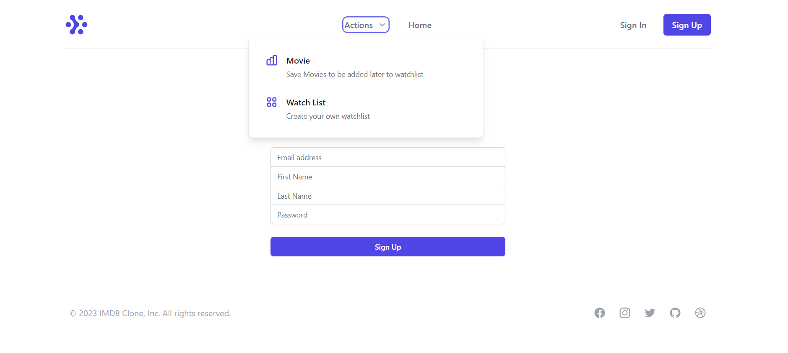
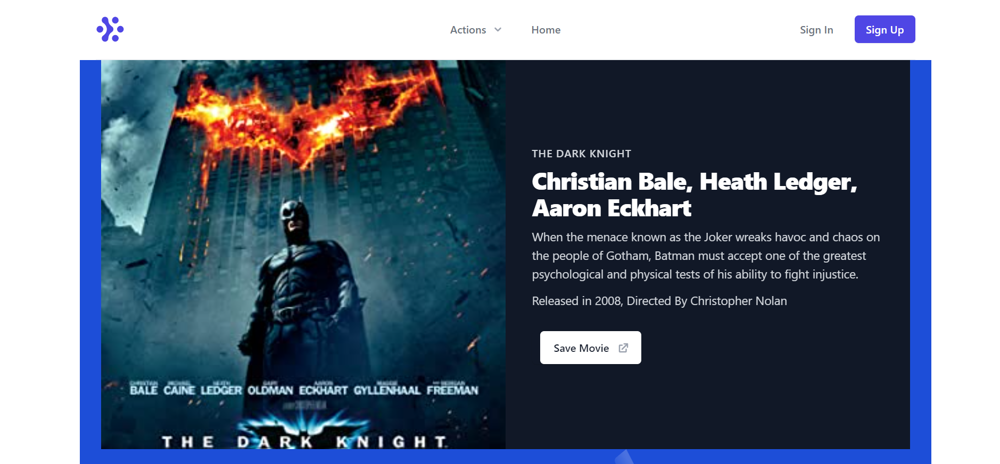
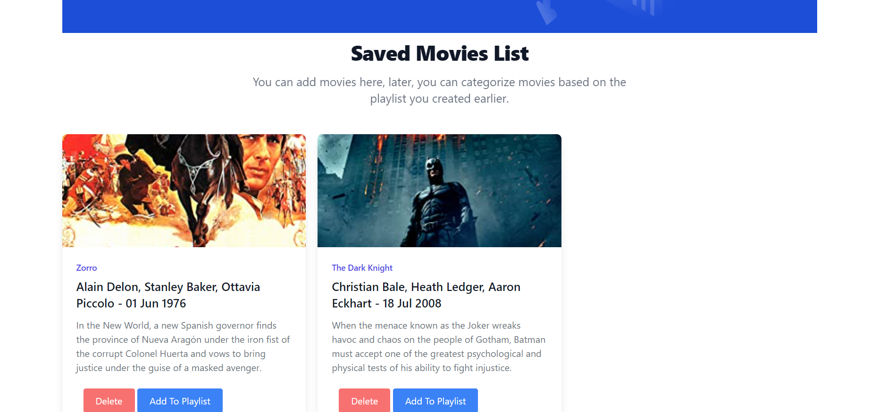

# IMDB Clone

## Background

I wanted to learn more about server side rendering and Nuxt JS. I went through docs of Nuxt JS, a few crash courses and wanted to test my skills with a project. Hence, this came into existence.

This project uses this API built in Express :- https://github.com/Apfirebolt/open-movie-database

## Technologies Used


The contents for the READ ME below come from default Nuxt JS project. The project has been bootstrapped using create-nuxt-app CLI tool.

## Features

- User can search for a movie on IMDB and save the movie.
- Saved movies would be displayed on the dashboard of the user, users can then add saved movies to watchlist.
- CRUD on watchlist

## Build Setup

```bash
# install dependencies
$ npm install

# serve with hot reload at localhost:3000
$ npm run dev

# build for production and launch server
$ npm run build
$ npm run start

# generate static project
$ npm run generate
```

For detailed explanation on how things work, check out the [documentation](https://nuxtjs.org).

## Screenshots

Please find some of the screenshots of the application. Below is the screenshot of the Register Page. Tailwind CSS components from TailwindUI is used to create this.



Movie page which shows searched movie data. Data is being fetched from the Open movie database which requires key for authentication. 



Another screenshot of the movie page shows the saved movies which are stored in the database.



Below are some of the details related to NUXT JS, a popular SSR framework built on top of Vue JS.

## Special Directories

You can create the following extra directories, some of which have special behaviors. Only `pages` is required; you can delete them if you don't want to use their functionality.

### `assets`

The assets directory contains your uncompiled assets such as Stylus or Sass files, images, or fonts.

More information about the usage of this directory in [the documentation](https://nuxtjs.org/docs/2.x/directory-structure/assets).

### `components`

The components directory contains your Vue.js components. Components make up the different parts of your page and can be reused and imported into your pages, layouts and even other components.

More information about the usage of this directory in [the documentation](https://nuxtjs.org/docs/2.x/directory-structure/components).

### `layouts`

Layouts are a great help when you want to change the look and feel of your Nuxt app, whether you want to include a sidebar or have distinct layouts for mobile and desktop.

More information about the usage of this directory in [the documentation](https://nuxtjs.org/docs/2.x/directory-structure/layouts).


### `pages`

This directory contains your application views and routes. Nuxt will read all the `*.vue` files inside this directory and setup Vue Router automatically.

More information about the usage of this directory in [the documentation](https://nuxtjs.org/docs/2.x/get-started/routing).

### `plugins`

The plugins directory contains JavaScript plugins that you want to run before instantiating the root Vue.js Application. This is the place to add Vue plugins and to inject functions or constants. Every time you need to use `Vue.use()`, you should create a file in `plugins/` and add its path to plugins in `nuxt.config.js`.

More information about the usage of this directory in [the documentation](https://nuxtjs.org/docs/2.x/directory-structure/plugins).

### `static`

This directory contains your static files. Each file inside this directory is mapped to `/`.

Example: `/static/robots.txt` is mapped as `/robots.txt`.

More information about the usage of this directory in [the documentation](https://nuxtjs.org/docs/2.x/directory-structure/static).

### `store`

This directory contains your Vuex store files. Creating a file in this directory automatically activates Vuex.

More information about the usage of this directory in [the documentation](https://nuxtjs.org/docs/2.x/directory-structure/store).
